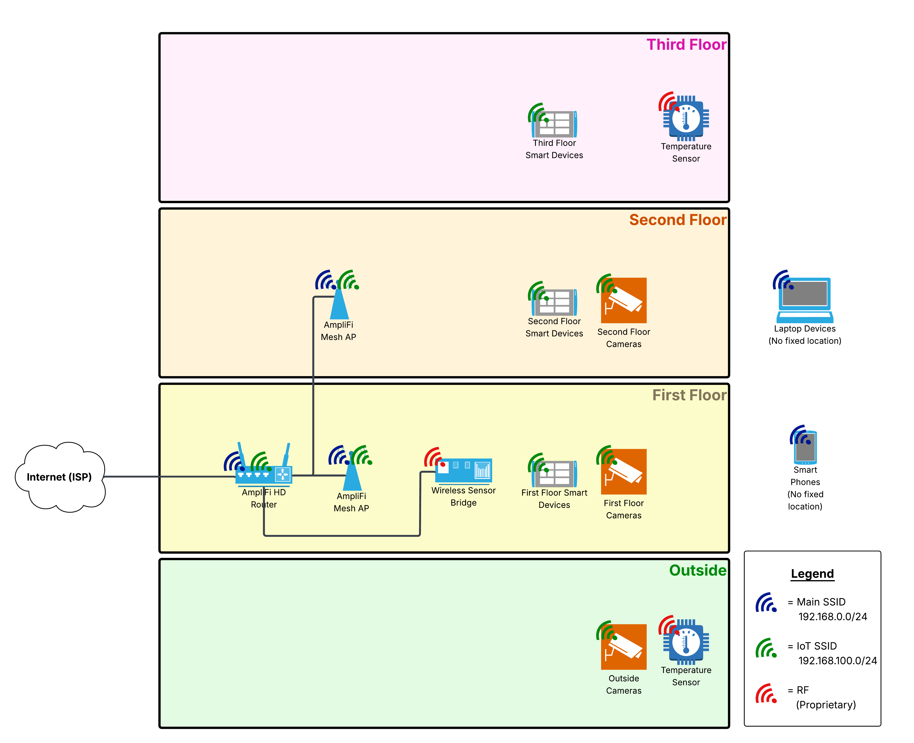

# exp-net-fundamentals-2025-Q2

## Design Considerations

The architecture diagram shows the wireless network of a three (3) story house, with outside yard.

* :house::book: [Journal](journal/week1/diagramming/Journal.md)

## Projects & Journals

* :rocket: [Environment Automation](projects/env_automation/README.md)
  * :book: [Journal](projects/env_automation/Journal.md)
* :mailbox_with_mail: [IP Address Management in Azure](projects/ip_address_management/README.md)
  * :book: [Journal](projects/ip_address_management/Journal.md)
* :mag_right: State of Network - Packet Tracer
  * :book: [Journal](/projects/ip_address_management/Journal.md)
* :window: Windows Networking
  * :book: [Journal](/projects/windows_networking/Journal.md)
* :bricks: [Windows Firewall Rules](/projects/windows_firewall_rules/README.md)
  * :book: [Journal](/projects/windows_firewall_rules/Journal.md)
* :penguin: Linux Networking
  * :book: [Journal](/projects/linux_networking/Journal.md)

:end: