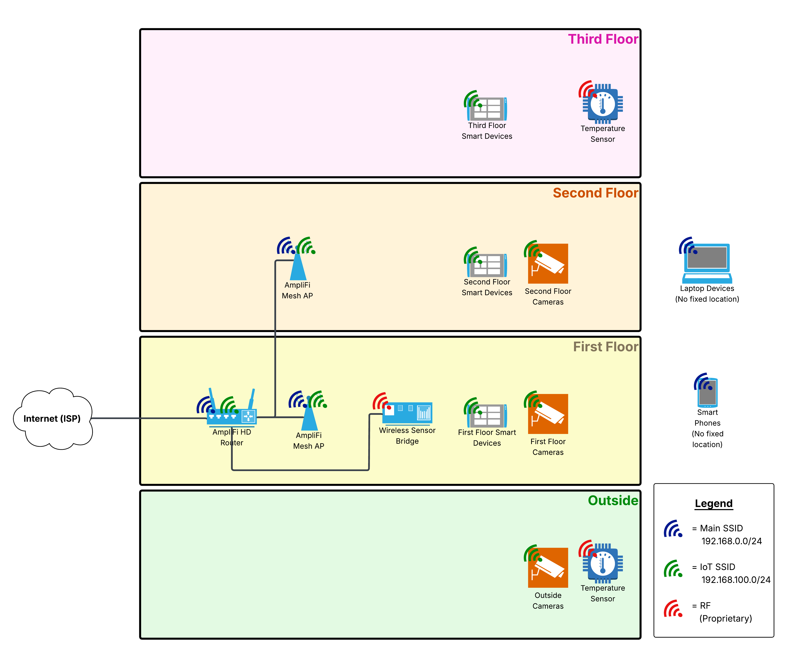

# :house::book: Diagramming Journal

The architecture diagram shows the wireless network of a three (3) story house, with outside yard.

## Requirements

1. Must leverage the existing Internet connection.
2. Must support existing wireless devices such as:
   * Cameras
   * Laptops
   * Smart Phones
   * Smart Devices (displays, speakers)
3. WiFi coverage must be strong and reliable throughout the house and immediate surroundings (yard / outside).
4. Must be able to reliably read data from temperature sensors which may be located beyond the distance a typical _WiFi 5_ device can reach.
5. Smart devices and other _IoT_ type devices should have some additional security considerations due.

## Constraints

1. Existing Internet connection is hardwired to the _First Floor_ and shouldn't be moved (financial impact).
2. [_Wireless Sensor Tags_](https://wirelesstags.net) hub and wireless remote temperature sensors have already been purchased. They have a range of approximately _200m_ when placed 1m above ground.
3. Must cost as little as possible, and avoid purchasing new equipment.

> :money_with_wings: **Secret Constraint** :money_with_wings:
> 
> [_Lucid Chart_](https://lucidchart.com), which was used to create the diagram, has a limit of 60 objects per diagram for users with a free account. This limited the scope of what can be shown in this network diagramming exercise. Hence the focus on wireless networking.

## Design Considerations

Based on the requirements and constraints, we created a network that has the following considerations:

1. Existing _AmpliFi HD Gamer's Edition_ mesh router and access points are capable of meeting requirements and will be used.
2. The main _AmpliFi_ router will be placed on the _First Floor_ and connect via _Cat6_ ethernet cable to the _Internet_ connection (via _ISP Modem_, not shown). This router will provide the _Main_ WiFi SSID (shown on the diagram in blue). This network will use the `192.168.0.0/24` subnet. This subnet is also used for any wired connections to the router.
3. An _AmpliFi_ mesh access point (AP) will be placed on the first floor, close to an exterior wall in order to provide coverage to the outside, due to their being a number of exterior WiFi cameras.
4. An _AmpliFi_ mesh access point (AP) will be placed in a central location on the second floor, to provide general access to WiFi, as well as specifically cover third floor wireless devices.
5. An _IoT_ WiFi SSID will be enabled on the _AmpliFi_ router, which makes a separate isolated WiFi network available for IoT devices to connect to (shown on the diagram in green). This network will use the `192.168.100.0/24` subnet. This satisfies the requirement to provide more security for IoT devices.
6. The _Wireless Sensor Bridge_ will be connected via _Cat6_ ethernet cable to the _AmpliFi_ router. Wireless temperature sensors will connect to this bridge over its proprietary, longer range, RF signal (shown on the diagram in red).
7. The placement of the _AmpliFi_ router and mesh APs means that any non-IoT end devices, such as smart phones and laptops, will have coverage throughout the house and across the yard outside.
8. Since existing devices were used, no net new spend was required.

:end: