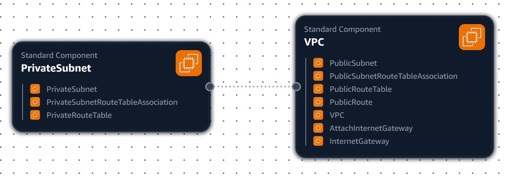
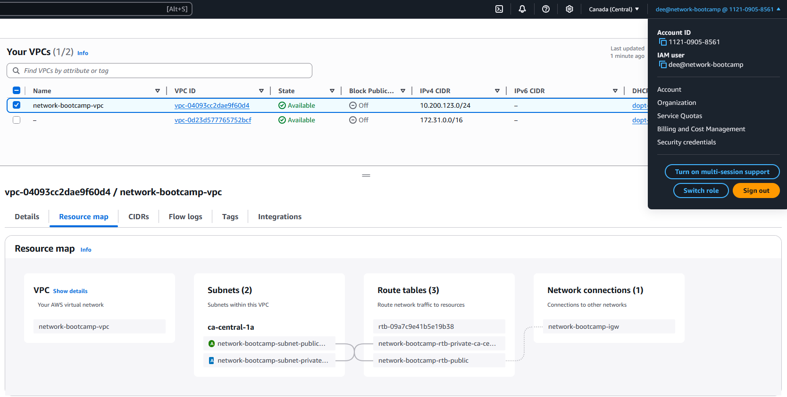
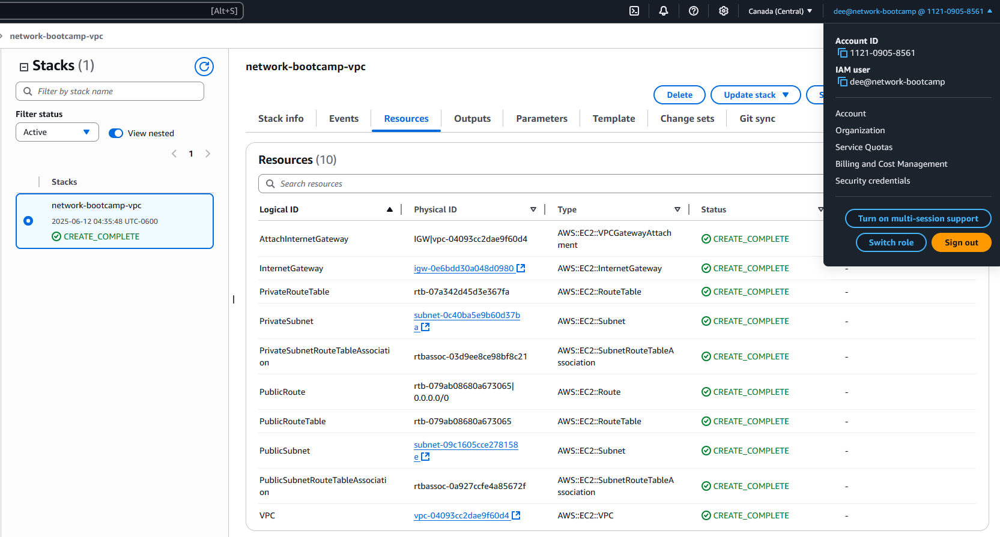

# :rocket::book: Environment Automation Journal

## AWS VPC Automation

Following is a list of configuration values used to create a VPC for the _[ExamPro Networking Fundamentals Bootcamp](https://camp.exampro.co/net)_. The goal here is to capture all of the values necessary to create a VPC suitable for the bootcamp.

Some of these values are specific to my needs, such as the availability zone used. Make sure you adjust these values to meet your own needs where necessary.

* VPC settings:
  * VPC Name tag value: `network-bootcamp-vpc`
  * IPv4 CIDR block: `10.200.123.0/24`
  * IPv6 CIDR block: **No IPv6 CIDR block**
  * Number of Availability Zones (AZs): **1**
  * First availability zone: **ca-central-1a**
  * Number of public subnets: **1**
    * Public subnet name: `network-bootcamp-subnet-public1-ca-central-1a`
    * Public subnet CIDR block: `10.200.123.0/28`
    * Public route table name: `network-bootcamp-rtb-public`
  * Number of private subnets: **1**
    * Private subnet name: `network-bootcamp-subnet-private1-ca-central-1a`
    * Private subnet CIDR block: `10.200.123.128/28`
    * Private route table name: `network-bootcamp-rtb-private-ca-central-1a`
  * NAT gateways: **None**
  * VPC endpoints: **None**
  * Internet gateway name: `network-bootcamp-igw`
  * DNS options:
    * Enable DNS hostnames: **Checked / Enabled**
    * Enable DNS resolution: **Checked / Enabled**

## Generate & Review CFN Template

The VPC settings are derived from [Tim McConnaughy](https://www.linkedin.com/in/tmcconnaughy)'s _Setup Cloud Environment_ video from the bootcamp. They are either values that Tim explicitly enters, or values that the _Create VPC_ wizard auto-generates during setup.

These settings were then provided to [_ChatGPT_](https://chatgpt.com/) to create the _AWS CloudFoundation (CFN)_ template. It was also prompted to ensure parameters were used so that hardcoded values were abstracted. This improves reusability.

> :question: ***How'd They Do That?*** :question:
> 
> A prompt was created along the lines of: 
>> _Please create an AWS CloudFormation template to setup a VPC using the following configuration:_
>> _\<pasted_config\>_
>
> Where the `<pasted_config>` are the VPC configuration values. Once the template was generated, _ChatGPT_ was prompted to refactor it so that the template is parameterized, which is considered a good practice:
>> _Please refactor the template to use parameters._
>
> The resulting template was then reviewed for quality control and to ensure it incorporated all of our configuration.

## Generate Deployment Script

_ChatGPT_ is tasked with creating a [`bin/deploy`](bin/deploy) _bash_ script. It is then asked to make improvements to the script for compatibility, quality, and ease of use reasons:

* [_Shebang_](https://en.wikipedia.org/wiki/Shebang_(Unix)) adjusted to be more OS agnostic.
* Parameters adjusted to reuse the _region_ parameter to avoid duplication and abstract specific configuration.
* Abstract the _"network-bootcamp"_ string into a _project_ parameter so that it can be referenced by other parameters as well as easily changed. Again for deduplication and abstraction purposes.
* Optionally allow the _project_ and _region_ parameters to be passed as command line options, so that the script can be used without having to modify it.
* Add a feature that waits for the VPC deployment to complete before displaying the script results. This eliminates a potential race condition.

> :question: ***How'd They Do That?*** :question:
>
> In the same _ChatGPT_ session where the template was created, a simple prompt requested a deployment script:
>> _Please create a bash script to deploy this CFN template._
>
> After reviewing the resulting script, _ChatGPT_ was prompted to make some improvements:
>> _Please update the script so that the shebang is more platform agnostic, and the region parameter is used by the other parameters where it is duplicated. Also make the string "network-bootcamp" a project parameter and make sure the other parameters use it were appropriate. The project and region parameters should be able to optionally be passed as command line options._
>
> The revised script had just about all of the features we were looking for, however _ChatGPT_ did not add the wait feature, so we prompted for that as well:
>> _Modify the script to wait for the deploy to complete before running describe-stacks._
>
> The resulting script was saved as [`bin/deploy`](bin/deploy) and references to the AWS CLI documentation were added manually. The **TEMPLATE_FILE** variable was also manually changed to `"template.yaml"` to match prescribed bootcamp conventions.

> :exclamation: Pay Attention :exclamation:
>
> During testing it was identified that the `deploy` script incorrectly formatted the parameters to pass to the _AWS CLI_.
>
> The script listed each parameter as:
>> `ParameterKey=<Key>,ParameterValue=<Value>`
>
> Where `<Key>` and `<Value>` are the respective key name and configuration value. The parameters should be listed in this format:
>> `<Key>=<Value>`
>
> The script was manually edited to make this change for all parameter key/value pairs.
>
> If you notice that your deployment ignores the parameters in the `deploy` script and instead uses the default parameter values from `template.yaml` you may have a similar issue.

### Deployment Script File Type

Since our script is going to be deployed within _Ubuntu_ on _WSLv2_, we have to make sure that the files are saved as a UNIX-compatible file type.

If we do _not_ do this, then the script will be saved as a _Windows_ compatible file type, and we can get the following error message when we try to run the script:

```sh
/usr/bin/env: ‘bash\r’: Permission denied
```

Note the `\r` which Windows uses at the end of lines in a text file, but _UNIX / Linux_ does not. This means that `bash` on _Ubuntu_ believes that we're asking for the script to be run with a shell called `bash\r` instead of `bash`.

> :question: ***How'd They Do That?*** :question:
>
> Remedy this issue in _VS Code_ by following these steps:
>
> 1. In _VS Code_ open the `deploy` script file in the editor.
> 2. Look for the **CRLF** indicator in the bottom-right of the _VS Code_ window.
> 3. Click the **CRLF** indicator, and a _"Select end of line sequence"_ selector will appear.
> 4. Click **LF** to choose the UNIX style line ending.
>
> The `deploy` script will be saved using this end of line sequence from now on.

## VPC Visualization in AWS Infrastructure Composer

Following is a visualization of our VPC's [`template.yaml`](./template.yaml) via [_AWS Infrastructure Composer_](https://aws.amazon.com/infrastructure-composer/) in [_Microsoft VS Code_](https://code.visualstudio.com/). Note that this does not provide the best visualization. It is presented here as proof of work.



> :question: ***How'd They Do That?*** :question:
>
> The _AWS Toolkit_ extension in _VS Code_ integrates _Infrastructure Composer_ into the editor. When the _VPC_ template is open & active, there's an **Open with Infrastructure Composer** button available. This opens the composer and creates the diagram.
> 
> The image is exported using the **Export canvas** menu option in _Infrastructure Composer_. The saved image file is then cropped via [_GIMP_](https://www.gimp.org/) to remove blank areas and center the visually interesting components.

## Installing AWS Command Line Interface (CLI)

Our deploy script depends on the _AWS CLI_, so it must be installed on the system that we execute from.

Follow the [AWS Command Line Interface Installation Instructions](https://docs.aws.amazon.com/cli/latest/userguide/getting-started-install.html#getting-started-install-instructions) for your operating system.

> :question: ***How'd They Do That?*** :question:
>
> Our development environment is _Ubuntu_ on _Windows Subsystem for Linux 2 (WSL2)_. Conveniently, as per the _AWS CLI User Guide_, AWS maintains a `snap` package for _AWS CLI v2_. This ensures that we will get an updated & maintained version of the _AWS CLI_ if we use `snap`.
> 
> We will follow the **"Snap package"** install instructions and run the following command:
>> `sudo snap install aws-cli --classic`
>
> Once the install is complete, we check that the _AWS CLI_ is installed:
>> `aws --version`
>
> If we get a response such as `aws-cli/2.27.34 Python/3.13.3 Linux/6.6.87.1-microsoft-standard-WSL2 exe/x86_64.ubuntu.24` then it has installed correctly.

## Deployed Resources to AWS

Following is the VPC resource map of the `network-bootcamp-vpc` deployed using AWS CloudFormation (CFN).



Following is the list of resources deployed for the `network-bootcamp-vpc` stack, as shown in `AWS CloudFormation`.



:end: