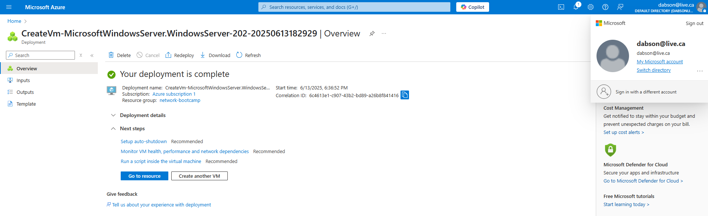
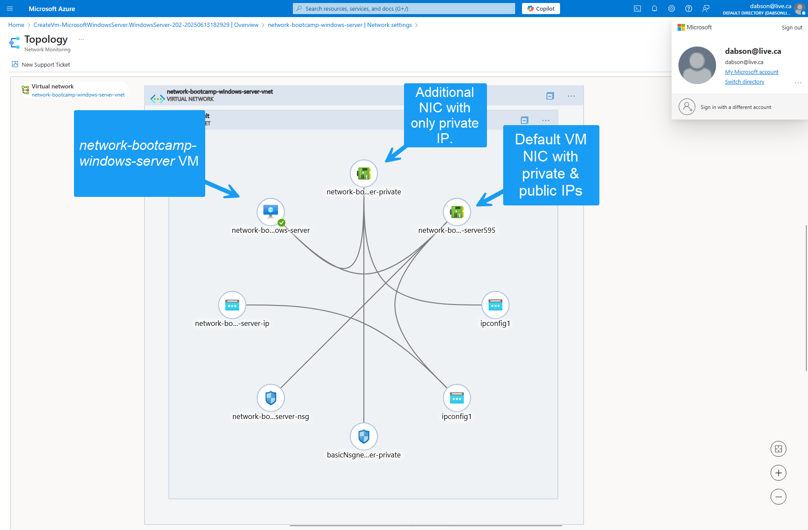
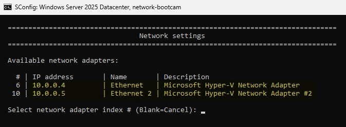
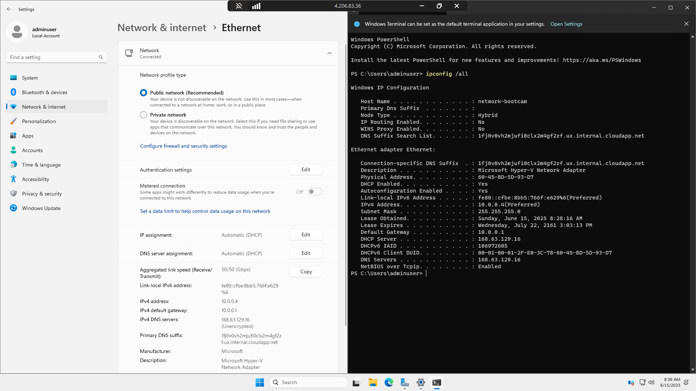

# :mailbox_with_mail::book:IP Address Management in Azure Journal

## Downloaded Azure Resource Template

After deploying _Microsoft Windows Server 2025 Datacenter Core_ on _Azure_ I downloaded the [VM Resource Templates](templates/vm/) so that we can easily deploy the VM again.

Following is a screenshot showing the completion of the Azure VM deployment.



After the VM was deployed, I created and attached a second NIC to the VM. This NIC was created without a public IP, so that it replicates the "private only" NICs from other CSPs.

Following is a screenshot showing the `network-bootcamp-windows-server` VM topology after adding the second NIC.



Following is a screenshot from within the Azure VM showing both NICs connected and configured.



## Install the Azure CLI

Our deploy depends on the _Azure Command Line Interface (CLI)_, so it must be installed on the system that we execute from.

Follow the [Azure CLI Installation](https://learn.microsoft.com/en-us/cli/azure/install-azure-cli-linux?view=azure-cli-latest&pivots=apt) for your operating system.

> :question: ***How'd They Do That?*** :question:
>
> Our development environment is _Ubuntu_ on _Windows Subsystem for Linux 2 (WSL2)_. _Microsoft_ conveniently provides a script that can run in Ubuntu to execute all of the steps needed to install _azure_cli_.
>
> This includes steps such as:
> 1. Installation dependencies.
> 2. Adding the _Microsoft_ software repo & signing key.
> 3. Installing _azure_cli_.
>
> The script is executed by running the following command:
> > `curl -sL https://aka.ms/InstallAzureCLIDeb | sudo bash`
>
> After the script finishes, we verify that _azure-cli_ is installed by running the following command:
> > `az version`
>
> If we get a response that includes something like `azure-cli 2.74.0` then it has installed correctly.

After _azure-cli_ is installed it has to be authenticated to our Azure account.

> :question: ***How'd They Do That?*** :question:
>
> To authenticate _azure-cli_, run the following command and follow its instructions:
> > `az login --use-device-code`
>
> Authentication is successful is you receive verifiable account information when you run the following command:
> > `az account show`

## Converting Resource Template to Azure Bicep

The VM deployed did not have the full GUI, indicating that a `Windows Server Core` image had been selected instead of a typical `Windows Server` image. Converting the Resource Template we downloaded earlier to _Azure Bicep_ will allow the VM to be redeployed.

> :question: ***How'd They Do That?*** :question:
>
> The _azure-cli_ can make a best-effort conversion from Resource Template to Bicep file. To do this, go into the vm template folder and run the appropriate _azure-cli_ command:
> > ```sh
> > cd ip_address_management/templates/vm
> > az bicep decompile --file template.json
> > ```
>
> If successful there will now be a [`template.bicep`](templates/vm/template.bicep) file in your template folder.

After converting the Resource Template, a visual inspection suggests that it's too verbose and is not simplified enough compared to a typical bicep file. There are also additional configuration values that are still hard coded and can be parameterized to make the template more reusable.

> :question: ***How'd They Do That?*** :question:
>
> _ChatGPT_ is used to give us a hand in simplifying the new bicep file. This is done by using a prompt like:
> > _Here is my bicep template file:_
> > 
> > _\<contents of bicep file\>_
> > 
> > _Please give me a minimal bicep version of this file._
>
> Where `<contents of bicep file>` are the pasted contents from the `template.bicep` file.
>
> The resultant file still had configuration values hard coded in the template, so we prompted _ChatGPT_ to parameterize them:
> > _Please lift up all of the configuration values, such as sku, into parameters._
> 
> The resultant file was reviewed for quality, and we found that _ChatGPT_ swapped out our image SKU for an older version (likely based on the version of information available to _ChatGPT_). The SKU was manually changed to `2025-Datacenter-G2`.

Since _ChatGPT_ helped us make our bicep template more efficient, we need to ensure that the `parameters.json` file will work with the bicep template.

> :question: ***How'd They Do That?*** :question:
>
> _ChatGPT_ was asked to make sure that the `parameters.json` file works with our bicep template. To do this we use the same _ChatGPT_ session where we modified our bicep template, and prompt it with something like:
> > _Here is my current parameters json file for this template:_
> > 
> > _\<contents of parameters json file\>_
> > 
> > _Please update it to work with the bicep template._
>
> Where `<contents of parameters json file>` are the pasted contents from the `parameters.json` file.
> 
> The resultant file was reviewed for quality, and since we manually modified the image SKU in our bicep file but _ChatGPT_ didn't know that, we manually modified `imageSku` to `2025-Datacenter-G2` in our parameters file as well.

We had to fix an error about the VM host name being too long.

> :exclamation: Pay Attention :exclamation:
>
> During testing it was discovered that the updated files that _ChatGPT_ generated decided to pass the _Azure VM_ name as the host name of our virtual machine.
>
> While in practice this appears to be a straight forward efficiency, _Microsoft Windows_ VMs have a limitation of 15 characters for their host name.
>
> To fix this, we manually added a new parameter, `virtualMachineComputerName` to both the bicep and parameters file, making sure to limited its value to 15 characters. The `osProfile.computerName` entry in the template was updated to use this new parameter.

We received the error `The content for this response was already consumed`. Troubleshooting revealed that this was due to our _Azure Subscription_ not having any CPU quotas for the size of 

> :exclamation: Pay Attention :exclamation:
>
> During testing it was discovered that the VM size we specified did not have any CPU quota available in our _Azure Subscription_ for the _Azure Region_ we're deploying to.
>
> Interestingly, we can use this VM size if we opt our VM into _Azure Spot_, where the VM can be "evicted" (either deallocated or deleted) if Azure determines that it needs the resources.
>
> To opt our VM into _Azure Spot_, we had to modify our bicep template to add the following properties to our `virtualMachine` resource:
> > ```bicep
> > priority: 'Spot' // Enables Spot VM pricing
> > evictionPolicy: 'Deallocate' // or 'Delete' - what happens on eviction
> > billingProfile: {
> >   maxPrice: -1 // -1 means pay up to the on-demand price; or specify max $/hour
> > }
> > ```

The VM successfully deployed after addressing the above errors. Unfortunately we were not able to connect remotely via _RDP_.

> :exclamation: Pay Attention :exclamation:
>
> Troubleshooting revealed that our VM was not deployed with a security group rule to allow RDP inbound.
>
> To fix this we added the rule to our `networkSecurityGroup` resource in the `template.bicep` file:
> > ```bicep
> > securityRules: [
> >   {
> >     name: 'Allow-RDP'
> >     properties: {
> >       priority: 300
> >       protocol: 'Tcp'
> >       access: 'Allow'
> >       direction: 'Inbound'
> >       sourceAddressPrefix: '*'
> >       sourcePortRange: '*'
> >       destinationAddressPrefix: '*'
> >       destinationPortRange: '3389'
> >     }
> >   }
> > ]
> > ```

As proof of work, the following is a screenshot from our _Bicep_ deployed _Windows Server 2025 Datacenter_ VM showing a GUI and terminal representation of the network adapter.



## Conclusion

* I was able to attach a second NIC to the _Windows Server 2025 Datacenter Core_ VM that was initially provisioned.
* I was able to successfully deploy a VM from the _Azure Bicep_ template.
* I was able to adjust the template to deploy the "regular" (non-core) version of _Windows Server 2025 Datacenter_.
* I created a deployment script and successfully tested it.
* I learned a lot about _Microsoft Azure_ VM deployment.

:end: