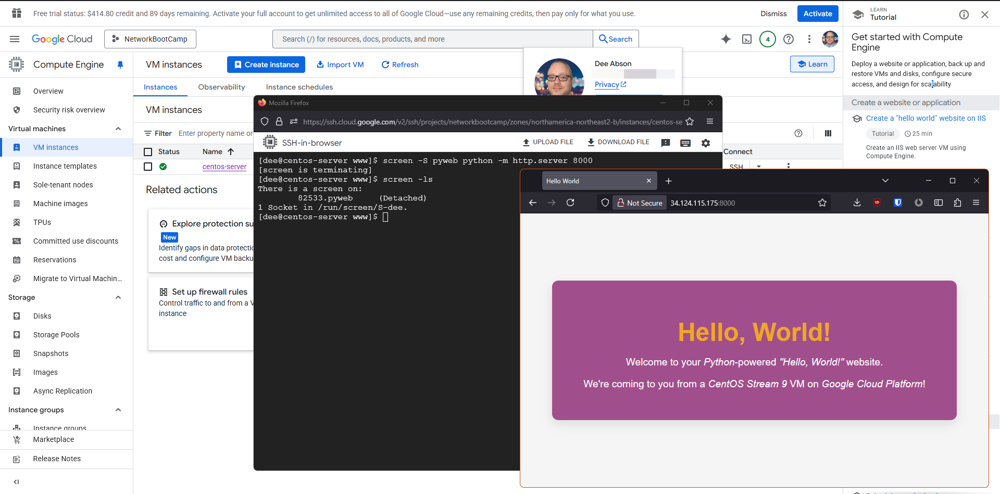
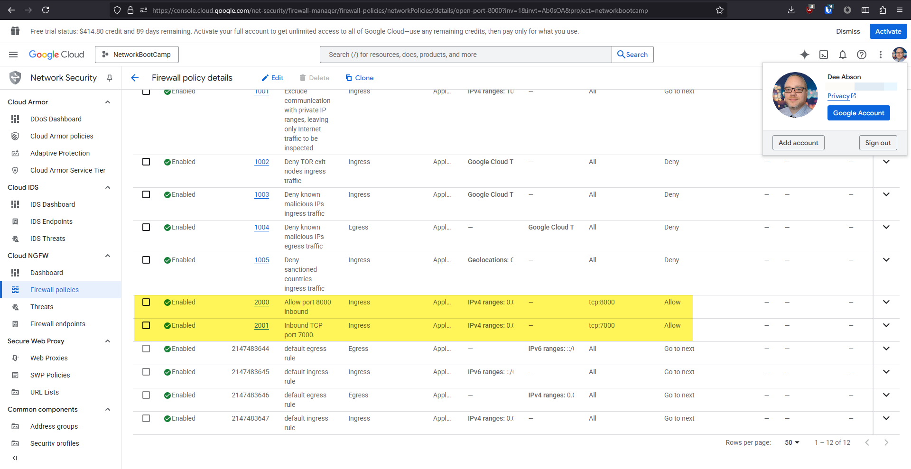
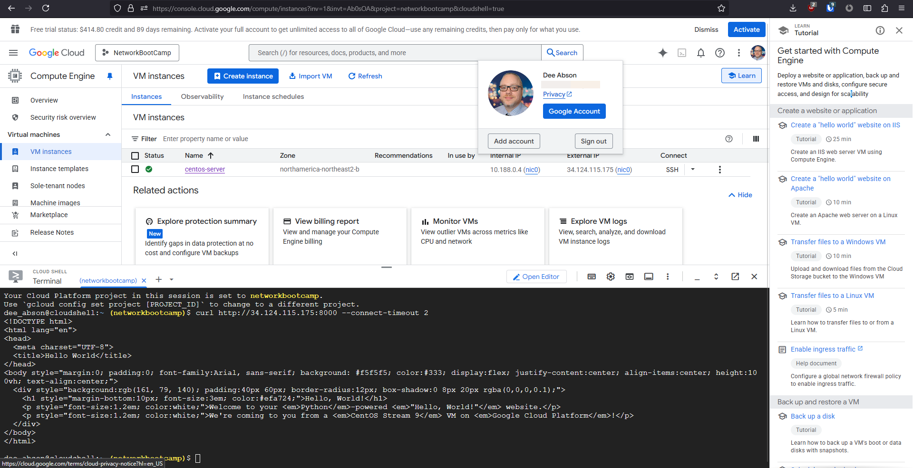

# :penguin::bricks::book: Linux Firewall Rules Journal

## Goal

We want to see how easy or difficult it is to manage _Google Cloud Platform (GCP)_ firewall rules, and _Linux_ firewall rules.

## Considerations

We launched a _CentOS Stream 9_ VM on _GCP_. We weren't sure what is installed by default.

## Investigation

* _iptables_ was already installed.
* _Python_ was already installed.

We were able to edit the _iptables_ rules through commands. Directly editing _iptables_ files wan'st possible and even if we could it's not recommended.

We could have used _firewalld_ on _CentOS_ as it's based on _Red Hat Enterprise Linux_ (or _ufw_ if we were using a _Debian_ or _Ubuntu_ distribution). Instead we wanted to get experience with _iptables_ since on some machines we might not be allowed to install packages.

> :question: ***How'd They Do That?*** :question:
>
> Here's how we setup our _Python_-based web server on _CentOS Stream 9_. We decided to install and use _screen_ to manage the web server, as this would allow us to run it in the background and be able to easily return to it when we need to.
>
> _screen_ is not available by default on _CentOS Stream 9_ so as part of these instructions we will add upstream _Enterprise Linux_ repos to get access to it.
>
> 1. Install _screen_ by running the following commands:
>    ```sh
>    sudo dnf install -y epel-release epel-next-release
>    sudo dnf clean all
>    sudo dnf makecache
>    sudo dnf install -y screen
>    ```
> 2. Make a directory to put your "mini-website" content into and go into that directory:
>    ```sh
>    mkdir www
>    cd www
>    ```
> 3. Create a file and use _vi_ to write a web page (we used the contents of [`index.html`](index.html)):
>    ```sh
>    touch index.html
>    vi index.html
>    ```
> 4. Once your file is written and saved, launch the _Python_-based web server using screen:
>    ```sh
>    screen -S pyweb python -m http.server 8000
>    ```
> 5. Once the web server start in _Python_, disconnect from the _screen_ session by typing `Ctrl+A`, the pressing `D`.
>
> Your web server is now running in the background.
> 
> To verify that the session is still running, use the command:
> > `screen -ls`
> 
> In the output, you should see a line that looks something like `81788.pyweb (Detached)`. To reconnect to this session, use the commmand:
> > `screen -r pyweb`
>
> If you want to stop the web server, from this screen type `Ctrl-C`. Or if you want to leave it running in the background, simply type `Ctrl-A` then `D` like before to detach.



## Outcomes

We were able to create a _GCP_ firewall policy and add rules that open ports `TCP 7000` and `TCP 8000`.



We were able to use _cURL_ with a 2-second timeout and reach our _Python_-based web site over port 8000.



We were able to configure an _iptables_-based nat redirect from port 7000 externally to port 8000.

The following shows the redirect rule in the _iptables_ nat rule list.

```sh
[dee@centos-server www]$ sudo iptables -t nat -L -n --line-numbers
Chain PREROUTING (policy ACCEPT)
num  target     prot opt source               destination         
1    REDIRECT   tcp  --  0.0.0.0/0            0.0.0.0/0            tcp dpt:7000 redir ports 8000

Chain INPUT (policy ACCEPT)
num  target     prot opt source               destination         

Chain OUTPUT (policy ACCEPT)
num  target     prot opt source               destination         

Chain POSTROUTING (policy ACCEPT)
num  target     prot opt source               destination         
```

> :question: ***How'd They Do That?*** :question:
>
> To create a redirect from port 7000 to port 8000 using _iptables_, we have to tell _iptables_ that we want to add a _nat_ rule that runs before any other rules, and does the actual redirection.
> 
> The command to do this looks like this:
> ```sh
> sudo iptables -t nat -A PREROUTING -p tcp --dport 7000 -j REDIRECT --to-port 8000`
> ```
>
> Where:
> * `-t nat` tells it to use the _nat_ table
> * `-A PREROUTING` tells is to execute the rule before any others
> * `-p TCP` tells it to use the _TCP_ transport protocol
> * `--dport 7000` tells it the destination port is _7000_
> * `-j REDIRECT` tells it to jump to a _redirect_ action
> * `--to-port 8000` tells the redirect to go to port _8000_

We could not enable the port 7000 redirect to port 8000 while blocking direct external access to port 8000 at the same time. Further investigation suggests that this may be possible on a system that supports _nftables_, like _CentOS Stream 9_. Direct configuration of _nftables_ is needed to control firewall behaviour in finer detail. However this seems to require that _nftables_ be enabled and _firewalld_/_iptables_ disabled for this to work.

It seems that _iptables_ is easy when using an AI coding assistant such as _ChatGPT_. There is no need for a simpler firewall like _ufw_ in this case unless we did not have access to an LLM and we wanted to use resources on the system, like _man_ and help at the command prompt. 

## iptables Command Reference

Here is a collection of _iptables_ commands that were learned during this project.

* Block incoming TCP traffic to port 8000.
  ```sh
  sudo iptables -A INPUT -p tcp --dport 8000 -j DUMP`
  ```
* Check that the rule was added.
  ```sh
  sudo iptables -L -n --line-numbers
  ```
* Remove the rule (where `INPUT 1` uses the line number from the above command).
  ```sh
  sudo iptables -D INPUT 1
  ```
* Redirect port 7000 to port 8000.
  ```sh
  sudo iptables -t nat -A PREROUTING -p tcp --dport 7000 -j REDIRECT --to-port 8000
  ```
* Check that the redirect rule was added.
  ```sh
  sudo iptables -t nat -L -n --line-numbers
  ``` 
* Remove the redirect rule (where `PREROUTING 1` uses the line number from the above command).
  ```sh
  sudo iptables -t nat -D PREROUTING 1
  ```

Here is a collection of some equivalent _firewalld_ commands that were learned during this project.

* Redirect port 7000 to port 8000.
  ```sh
  sudo firewall-cmd --permanent --direct --add-rule ipv4 nat PREROUTING 0 -p tcp --deport 7000 -j REDIRECT --to-port 8000
  sudo firewall-cmd reload
  ```
* Block incoming traffic to TCP port 8000.
  ```sh
  sudo firewall-cmd --permanent --direct --add-rule ipv4 filter INPUT 0 -p tcp --deport 8000 -j DROP
  sudo firewall-cmd reload
  ```

:end: