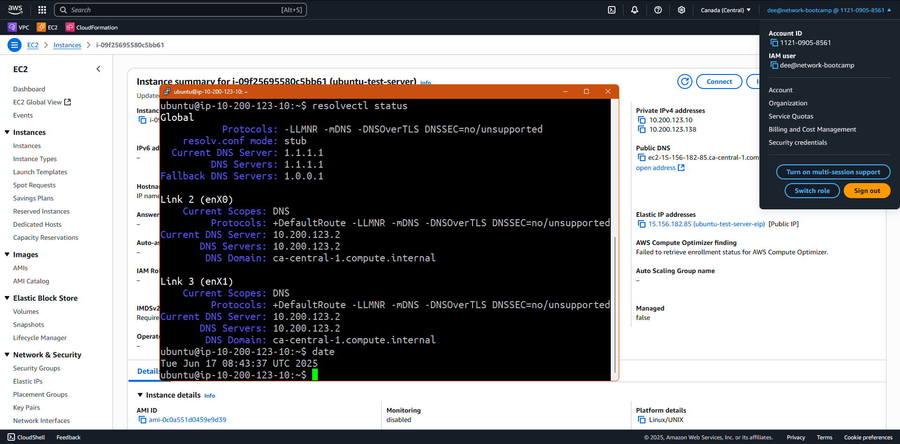
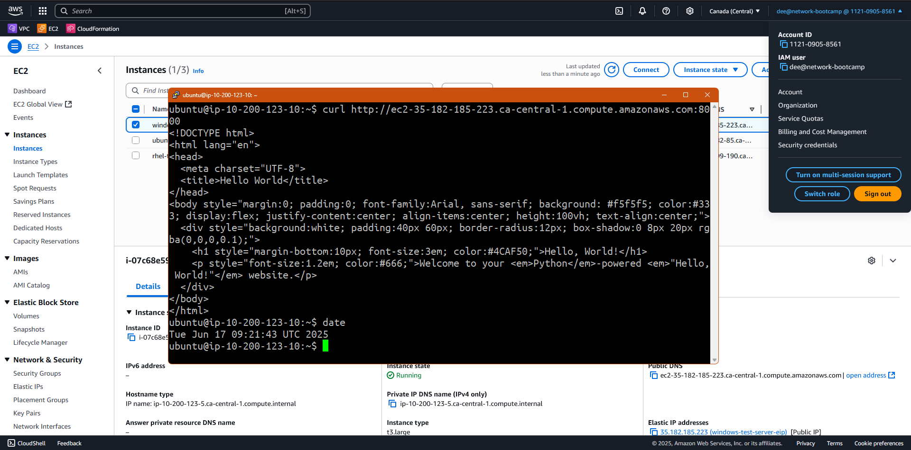
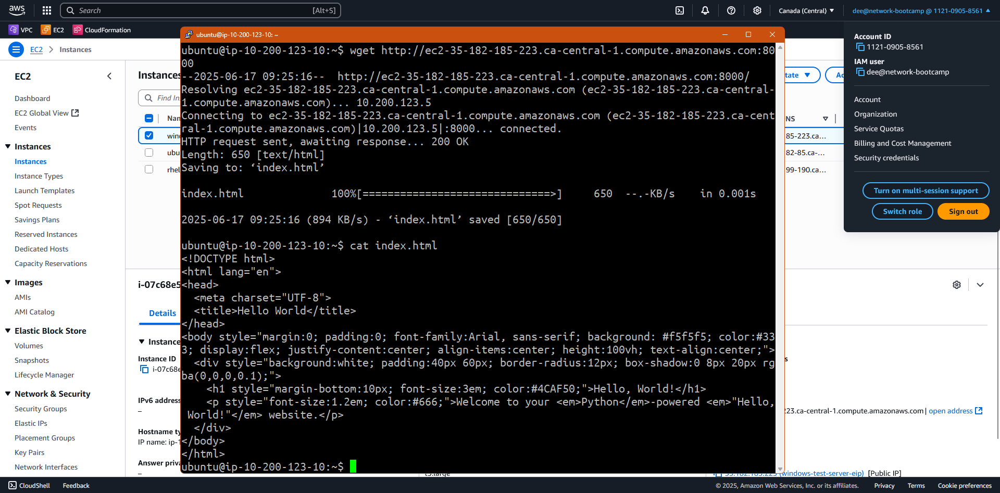

# :penguin::book: Linux Networking Journal

## Resolver



This screenshot shows that the _Global_ DNS servers have been updated to use _CloudFlare_'s DNS. Both as the main (`1.1.1.1`) and fallback (`1.0.0.1`) DNS servers.

> :question: ***How'd They Do That?*** :question:
>
> To change the DNS and Fallback DNS servers in _Ubuntu_ follow these steps:
>
> 1. Open the `resolved.conf` file with elevated privileges by executing the command:
>    ```sh
>    sudo nano /etc/systemd/resolved.conf`
>    ```
> 2. Within _nano_, find and uncomment the `#DNS=` line. Add the _CloudFlare_ primary resolver so that the line looks like:
>    ```sh
>    DNS=1.1.1.1
>    ```
> 3. Within _nano_, find and uncomment the `#FallbackDNS=` line. Add the _CloudFlare_ secondary resolver so that the line looks like:
>    ```sh
>    FallbackDNS=1.0.0.1
>    ```
> 4. Save the file by typing `^X` (`Ctrl+X`).
> 5. Restart the _resolved_ service by executing the following command:
>    ```sh
>    sudo systemctl restart systemd-resolved
>    ```
> 
> The DNS server configuration has now been changed. To verify the change, run the command:
> > `resolvectl status`

## wget vs cURL

_wget_ and _cURL_ are both useful tools commonly used for querying websites. They both allow you to ask websites for web pages or files.

_wget_ is used most often for downloading from websites. Whether that's web pages or files. In fact the default behaviour of _wget_ when you query a web site is for it to download the results. For example, if you query a website without specifying a particular path, you'll likely find that _wget_ has downloaded an `index.html`, `index.php` or other type of index page. Many scripts and software installation instructions (especially on _Linux_) reference _wget_ to download software. In addition to _http(s)_, _wget_ also supports **FTP**.

_cURL_ is used most often for displaying query results on screen. If you query a website the data received is shown. For example if you query a web site without specifying a path, you'll get the contents of the index page (such as `index.html`, or `index.php`) shown in your terminal. One of _cURL_'s strengths is that it supports many more protocols than just _http_ and _https_. _cURL_ can be used for other protocol queries such as **FTP**, **SCP**, **TELNET**, **LDAP**, **POP3**, **IMAP**, **SMTP** and others.

### cURL



This screenshot shows an example of _cURL_ output. Specifically, we're using _cURL_ to query our _Python_-based web server from the [Windows Firewall Rules](../windows_firewall_rules/README.md) project running on an _Windows Server 2025_ VM. By default _cURL_ displays the contents of the returned `index.html` on the screen.

### wget



This screenshot shows an example of _wget_ output. Specifically, we're using _wget_ to query our _Python_-based web server from the [Windows Firewall Rules](../windows_firewall_rules/README.md) project running on a _Windows Server 2025_ VM. Since _wget_ downloads the returned `index.html` file, we then use the `cat` command in the screenshot to show the contents of the file.

:end: