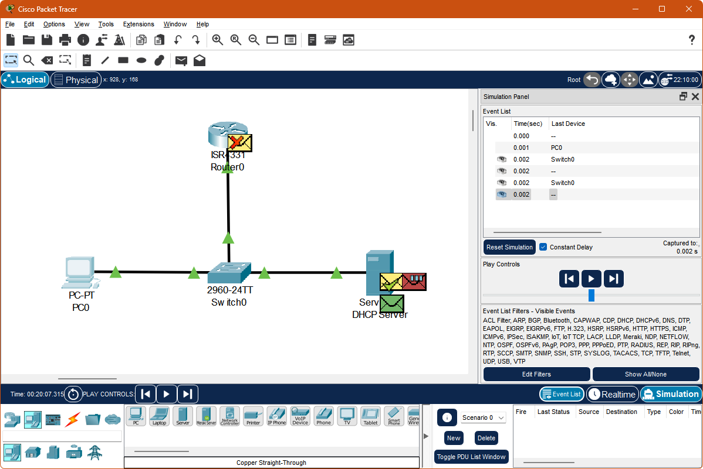

# :mag_right: State of the Network (Packet Tracer)

After following along with Tim's _Cisco Packet Tracer_ video, I simulated a simple network that illustrates how basic _DHCP_ functions.

Following is a screenshot of the _Packet Tracer_ simulated setup.

In the above screenshot, the PC `PC0` has requested an address via DHCP, and that request has just reached `DHCP Server`. The _DHCP_ service on `DHCP Server` has just accepted the _DHCP_ request.

At the same time, a copy of the DHCP request has also reached router `Router0`, since DHCP requests are sent as broadcasts (meaning every device on the same subnet receives the packet). `Router0` is rejecting the packet because it does not have a service listening on _UDP Port 67_ (the standard DHCP listening port).

:end: