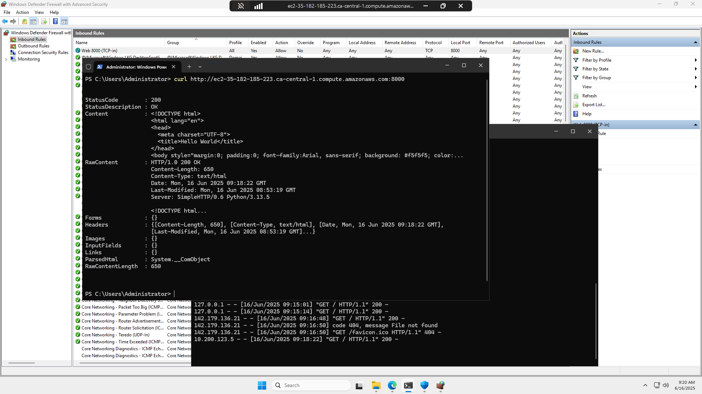
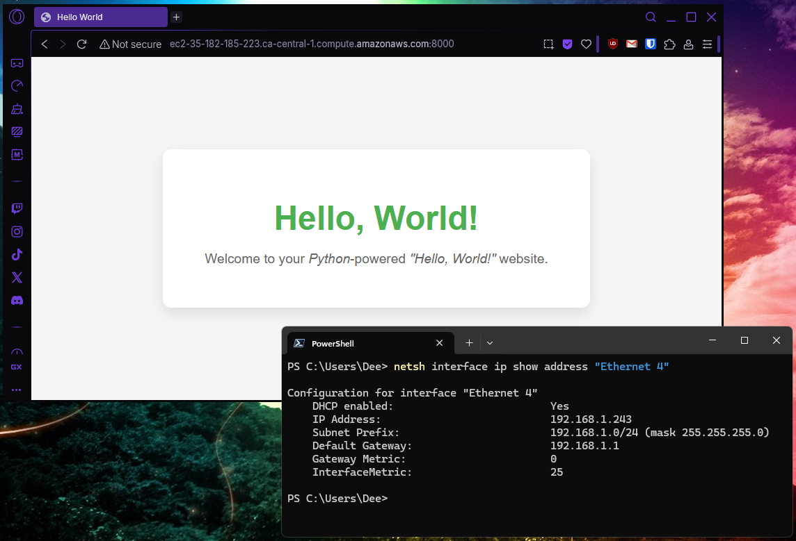

# :window::bricks::book: Windows Firewall Rules Journal

## Windows Defender Firewall Rules Testing Locally

We found that when you attempt to test firewall rules locally that you cannot test them on the system your define them on. This is because the traffic doesn't enter or exit the local system, so the firewall isn't traversed for the rules to potentially apply.

To properly test firewall rules we need to use a second machine where the web server could run, and use our local machine as a client to test connectivity.

## AWS Windows VM Serving Simple Website

We were able to start a web server using _Python_ to server a single static [web page](index.html).

The firewall rules block all inbound traffic that does not have a matching rule explicitly allowing it.

We added an inbound rule in _Windows Defender Firewall_ that allowed inbound TCP port 8000. Using _curl_ from our _AWS VM_ showed that the server was running locally.

In order to test the web server from outside of the _AWS VM_ we have to create an _inbound rule_ on the _AWS Security group_ associated with our VM. You can chose to either allow TCP 8000 from all source IPs, or for testing purposes, chose to allow only from "_My IP_".

> Note that the above screenshot uses `netsh interface ip show address` to display the IP address configuration of a specific interface on my local machine. This is because I have a complicated network setup locally (WiFi, multiple physical NICs, multiple virtual NICs, multiple VPN adapters, Bluetooth, WSL, etc.). It's much simpler to display my primary NIC this way.

## Install Python

We will use _Python_ to create our test web server. It must be installed on our _AWS VM_ running _Microsoft Windows Server 2025_.

> :question: ***How'd They Do That?*** :question:
>
> An easy way to install _Python_ on _Windows Server_ is to use the built in _winget_ package manager. Run the following command in the terminal to install _Python_:
> > `winget install -e --id Python.Python.3.13`
>
> Note that this is the latest version at time of testing. To see which versions of _Python_ are available to install, run the command:
> > `winget search --id Python.Python`
>
> Once _Python_ is installed, you must close your current terminal and open a new one so that the updated path is available.
>
> Run the following command in the new terminal to validate that _Python_ is installed:
> > `python --version`
>
> If you get a result such as `Python 3.13.5` then you have successfully installed _Python_.

## Create Windows Defender Firewall Rule

We had to create a _Windows Defender Firewall_ inbound rule to allow access to our web server on TCP port 8000.

> :question: ***How'd They Do That?*** :question:
>
> To create an appropriate inbound firewall rule to support our web server on TCP port 8000, follow these steps:
>
> 1. On the _Windows Server 2025_ VM, click the **Start Menu**, type `Windows Defender Firewall with Advanced Security` into the search bar, and click the **Open** button that appears.
> 2. In _Windows Defender Firewall with Advanced Security_, click on **Inbound Rules**, then _right-click_ **Inbound Rules** and select **New Rule**.
> 3. In the _New Inbound Rule Wizard_ window, click **Port**, and then click **Next**.
> 4. On the _Protocol and Ports_ step, make sure **TCP** is checked. Click **Specific local ports:** and enter `8000` in the text box. Click **Next**.
> 5. On the _Action_ step, make sure **Allow the connection** is checked, and click **Next**.
> 6. On the _Profile_ step, make sure that all of **Domain**, **Private**, and **Public** are checked, and click **Next**.
> 7. On the _Name_ step, give it a name like `Web 8000 (TCP-in)` and a description such as `Allow inbound port TCP 8000 to connect to our Python web server.` and click **Finish**.
>
> You should now be able to see that the rule is listed along side the other _Inbound Rules_ and that it is enabled.

## Create AWS Inbound Security Group Rule

To allow access to the _Python_-based web server on TCP port 8000, we had to create an inbound rule on the _Security Group_ associated with our VM in _AWS_.

> :question: ***How'd They Do That?*** :question:
>
> To create an inbound rule in _AWS_ to allow our _Python_-based web server to be accessed from outside of the VM, follow these steps:
> 
> 1. From the _AWS Console_, go to the **EC2 Dashboard**.
> 2. From the _EC2 Dashboard_, go to **Network & Security > Security Groups**.
> 3. From the list of _Security Groups_, locate the group that is associated with your VM, and click its **Security group ID**.
> 4. From the specific security group page, click **Inbound Rules**, then click the **Edit inbound rules** button.
> 5. From the _Edit inbound rules_ page, click the **Add rule** button.
> 6. In the new rule entry that appears, select a _Type_ of **Custom TCP**, a _Port range_ of `8000`, and a _Source_ of either **Anywhere-IPv4** or **MyIP** depending on your preference. Optionally provide a description like `Web port 8000 inbound` and click the **Save Rules** button.
>
> Your new rule is now created, and you should see it listed as one of the _Inbound rules_.

:end: