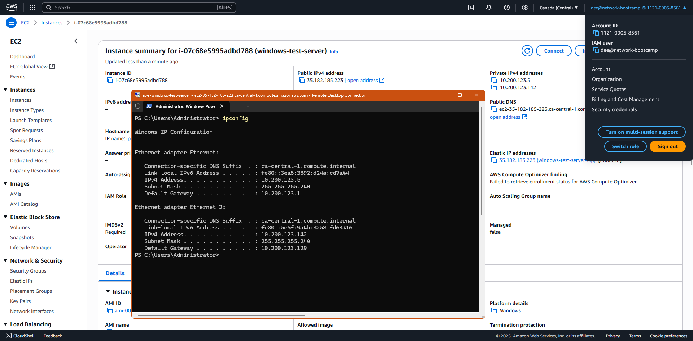

# :window::book: Windows Networking Journal

## Developer Environment



This screenshot shows that we're using a VM in _AWS EC2_. You can see that I am logged into the _AWS Console_ and that the ip addresses shown in the _RDP_ session match the private addresses in the _AWS Console_.

## IPConfig

```
PS C:\Users\Administrator> ipconfig /all

Windows IP Configuration

   Host Name . . . . . . . . . . . . : EC2AMAZ-JBGIMOI
   Primary Dns Suffix  . . . . . . . :
   Node Type . . . . . . . . . . . . : Hybrid
   IP Routing Enabled. . . . . . . . : No
   WINS Proxy Enabled. . . . . . . . : No
   DNS Suffix Search List. . . . . . : ec2.internal
                                       us-east-1.ec2-utilities.amazonaws.com
                                       ca-central-1.compute.internal
                                       ca-central-1.ec2-utilities.amazonaws.com

Ethernet adapter Ethernet:

   Connection-specific DNS Suffix  . : ca-central-1.compute.internal
   Description . . . . . . . . . . . : Amazon Elastic Network Adapter
   Physical Address. . . . . . . . . : 02-62-25-C5-7B-91
   DHCP Enabled. . . . . . . . . . . : Yes
   Autoconfiguration Enabled . . . . : Yes
   Link-local IPv6 Address . . . . . : fe80::3ea5:3892:d24a:cd7a%4(Preferred)
   IPv4 Address. . . . . . . . . . . : 10.200.123.5(Preferred)
   Subnet Mask . . . . . . . . . . . : 255.255.255.240
   Lease Obtained. . . . . . . . . . : Monday, June 16, 2025 6:31:19 AM
   Lease Expires . . . . . . . . . . : Monday, June 16, 2025 8:31:22 AM
   Default Gateway . . . . . . . . . : 10.200.123.1
   DHCP Server . . . . . . . . . . . : 10.200.123.1
   DHCPv6 IAID . . . . . . . . . . . : 84821943
   DHCPv6 Client DUID. . . . . . . . : 00-01-00-01-2F-DC-CB-E1-02-62-25-C5-7B-91
   DNS Servers . . . . . . . . . . . : 10.200.123.2
   NetBIOS over Tcpip. . . . . . . . : Enabled

Ethernet adapter Ethernet 2:

   Connection-specific DNS Suffix  . : ca-central-1.compute.internal
   Description . . . . . . . . . . . : Amazon Elastic Network Adapter #2
   Physical Address. . . . . . . . . : 02-EF-2E-C9-63-F5
   DHCP Enabled. . . . . . . . . . . : Yes
   Autoconfiguration Enabled . . . . : Yes
   Link-local IPv6 Address . . . . . : fe80::5e5f:9a4b:8258:fd63%16(Preferred)
   IPv4 Address. . . . . . . . . . . : 10.200.123.142(Preferred)
   Subnet Mask . . . . . . . . . . . : 255.255.255.240
   Lease Obtained. . . . . . . . . . : Monday, June 16, 2025 6:31:19 AM
   Lease Expires . . . . . . . . . . : Monday, June 16, 2025 8:31:19 AM
   Default Gateway . . . . . . . . . : 10.200.123.129
   DHCP Server . . . . . . . . . . . : 10.200.123.129
   DHCPv6 IAID . . . . . . . . . . . : 167964462
   DHCPv6 Client DUID. . . . . . . . : 00-01-00-01-2F-DC-CB-E1-02-62-25-C5-7B-91
   DNS Servers . . . . . . . . . . . : 10.200.123.2
   NetBIOS over Tcpip. . . . . . . . : Enabled
PS C:\Users\Administrator>
```

This is an example of the _ipconfig_ command run in our _AWS_ VM. The `/all` flag is passed to it, which shows all of the configuration information.

## Ping

```
PS C:\Users\Administrator> ping -4 camp.exampro.co

Pinging camp.exampro.co [54.192.51.57] with 32 bytes of data:
Reply from 54.192.51.57: bytes=32 time=1ms TTL=241
Reply from 54.192.51.57: bytes=32 time=1ms TTL=241
Reply from 54.192.51.57: bytes=32 time=1ms TTL=241
Reply from 54.192.51.57: bytes=32 time=1ms TTL=241

Ping statistics for 54.192.51.57:
    Packets: Sent = 4, Received = 4, Lost = 0 (0% loss),
Approximate round trip times in milli-seconds:
    Minimum = 1ms, Maximum = 1ms, Average = 1ms
PS C:\Users\Administrator> ping -a 54.192.51.57

Pinging server-54-192-51-57.yul62.r.cloudfront.net [54.192.51.57] with 32 bytes of data:
Reply from 54.192.51.57: bytes=32 time=1ms TTL=241
Reply from 54.192.51.57: bytes=32 time=1ms TTL=241
Reply from 54.192.51.57: bytes=32 time=1ms TTL=241
Reply from 54.192.51.57: bytes=32 time=1ms TTL=241

Ping statistics for 54.192.51.57:
    Packets: Sent = 4, Received = 4, Lost = 0 (0% loss),
Approximate round trip times in milli-seconds:
    Minimum = 1ms, Maximum = 1ms, Average = 1ms
PS C:\Users\Administrator>
```

This is an example of a _ping_ command. First, we ping _ExamPro_'s bootcamp subdomain, `camp.exampro.co`, and forcing an _IPv4_ ping using the `-4` flag.

The second ping is a reverse lookup, using the `-a` flag, of the IP address we received from the first ping. Interestingly the reverse lookup resolves to an _AWS CloudFront_ hostname.

## Tracert

```
PS C:\Users\Administrator> tracert -h 20 -4 camp.exampro.co

Tracing route to camp.exampro.co [54.192.51.124]
over a maximum of 20 hops:

  1     4 ms     3 ms     7 ms  ec2-52-60-0-23.ca-central-1.compute.amazonaws.com [52.60.0.23]
  2     *        *        *     Request timed out.
  3     *        *        *     Request timed out.
  4     *        *        *     Request timed out.
  5     *        *        *     Request timed out.
  6     *        *        *     Request timed out.
  7    17 ms    11 ms     9 ms  100.65.11.129
  8     1 ms     1 ms     2 ms  52.94.81.3
  9    15 ms     1 ms     1 ms  52.94.82.182
 10     1 ms     5 ms     3 ms  52.93.5.105
 11    22 ms    21 ms    21 ms  100.64.50.253
 12    15 ms    21 ms    20 ms  100.64.50.85
 13     1 ms     2 ms     4 ms  100.64.50.254
 14     2 ms     5 ms     7 ms  100.93.4.6
 15     8 ms     7 ms     7 ms  100.93.4.3
 16     1 ms     1 ms     1 ms  server-54-192-51-124.yul62.r.cloudfront.net [54.192.51.124]

Trace complete.
PS C:\Users\Administrator>
```

This is an example of the _tracert_ command. We're running a trace route against _ExamPro_'s bootcamp subdomain: `camp.exampro.co`. The `-4` flag forces _tracert_ to use IPv4 and the `-h 20` flag limits the number of hops checked to 20.

This trace route further confirms that _ExamPro_'s bootcamp subdomain relies on the _AWS Cloudfront CDN_.

## Netstat

```
PS C:\Users\Administrator> netstat

Active Connections

  Proto  Local Address          Foreign Address        State
  TCP    10.200.123.5:3389      d142-179-136-21:6805   ESTABLISHED
  TCP    10.200.123.5:49781     172.172.255.217:https  ESTABLISHED
  TCP    10.200.123.5:49933     a-0003:https           ESTABLISHED
  TCP    10.200.123.5:49934     150.171.27.11:https    ESTABLISHED
  TCP    10.200.123.5:49935     150.171.27.11:https    FIN_WAIT_2
  TCP    10.200.123.5:49936     pnyula-ab-in-f14:https  ESTABLISHED
  TCP    10.200.123.5:49937     150.171.27.11:https    ESTABLISHED
  TCP    10.200.123.5:49938     pnyula-ab-in-f1:https  ESTABLISHED
  TCP    10.200.123.5:49939     a23-222-17-170:https   ESTABLISHED
  TCP    10.200.123.5:49940     150.171.27.10:https    ESTABLISHED
  TCP    10.200.123.5:49941     20.110.205.119:https   ESTABLISHED
  TCP    10.200.123.5:49942     a23-223-17-169:https   CLOSE_WAIT
  TCP    10.200.123.5:49943     a23-223-17-169:https   ESTABLISHED
  TCP    10.200.123.5:49944     150.171.28.12:https    ESTABLISHED
  TCP    10.200.123.5:49945     a23-222-17-172:https   ESTABLISHED
  TCP    10.200.123.5:49946     server-3-161-213-80:https  ESTABLISHED
  TCP    10.200.123.5:49947     a23-223-17-201:https   ESTABLISHED
  TCP    10.200.123.5:49948     51.105.71.136:https    ESTABLISHED
  TCP    10.200.123.5:49950     a23-222-17-172:https   ESTABLISHED
  TCP    10.200.123.5:49951     a-0003:https           ESTABLISHED
  TCP    10.200.123.5:49952     a-0003:https           ESTABLISHED
  TCP    10.200.123.5:49953     204.79.197.219:https   ESTABLISHED
  TCP    10.200.123.5:49954     a23-222-17-172:https   ESTABLISHED
  TCP    10.200.123.5:49955     a23-222-17-172:https   ESTABLISHED
  TCP    10.200.123.5:49956     204.79.197.219:https   ESTABLISHED
  TCP    10.200.123.5:49957     150.171.27.11:https    ESTABLISHED
  TCP    10.200.123.5:49958     server-54-192-51-45:http  ESTABLISHED
  TCP    10.200.123.5:49959     server-54-192-51-45:http  ESTABLISHED
  TCP    10.200.123.5:49960     server-54-192-51-45:https  ESTABLISHED
  TCP    10.200.123.5:49962     4.152.133.8:https      ESTABLISHED
  TCP    10.200.123.5:49963     tzyula-aa-in-f10:https  ESTABLISHED
PS C:\Users\Administrator>
```

This is an example of the _netstat_ command. One of the items you can see in the output is that we have used a web browser to go to _ExamPro_'s bootcamp subdomain: `camp.exampro.co`.

By leveraging the information we gained from the _ping_ and _tracert_ we know that the `server-54-192-51-45` host is the _AWS CloudFront_ host for _ExamPro_'s bootcamp subdomain. We can see three (3) connections to this hostname. The first two (2) connections are over _http_, as the web browser establishes a connection. The third connection is over _https_, which shows that the web server successfully negotiated with the web browser to transition to the more secure _https_ protocol.

## Route

```
PS C:\Users\Administrator> route print
===========================================================================
Interface List
  4...02 62 25 c5 7b 91 ......Amazon Elastic Network Adapter
 16...02 ef 2e c9 63 f5 ......Amazon Elastic Network Adapter #2
  1...........................Software Loopback Interface 1
===========================================================================

IPv4 Route Table
===========================================================================
Active Routes:
Network Destination        Netmask          Gateway       Interface  Metric
          0.0.0.0          0.0.0.0     10.200.123.1     10.200.123.5     20
          0.0.0.0          0.0.0.0   10.200.123.129   10.200.123.142     20
     10.200.123.0  255.255.255.240         On-link      10.200.123.5    276
     10.200.123.5  255.255.255.255         On-link      10.200.123.5    276
    10.200.123.15  255.255.255.255         On-link      10.200.123.5    276
   10.200.123.128  255.255.255.240         On-link    10.200.123.142    276
   10.200.123.142  255.255.255.255         On-link    10.200.123.142    276
   10.200.123.143  255.255.255.255         On-link    10.200.123.142    276
        127.0.0.0        255.0.0.0         On-link         127.0.0.1    331
        127.0.0.1  255.255.255.255         On-link         127.0.0.1    331
  127.255.255.255  255.255.255.255         On-link         127.0.0.1    331
  169.254.169.123  255.255.255.255         On-link      10.200.123.5     40
  169.254.169.249  255.255.255.255         On-link      10.200.123.5     40
  169.254.169.250  255.255.255.255         On-link      10.200.123.5     40
  169.254.169.251  255.255.255.255         On-link      10.200.123.5     40
  169.254.169.253  255.255.255.255         On-link      10.200.123.5     40
  169.254.169.254  255.255.255.255         On-link      10.200.123.5     40
        224.0.0.0        240.0.0.0         On-link         127.0.0.1    331
        224.0.0.0        240.0.0.0         On-link      10.200.123.5    276
        224.0.0.0        240.0.0.0         On-link    10.200.123.142    276
  255.255.255.255  255.255.255.255         On-link         127.0.0.1    331
  255.255.255.255  255.255.255.255         On-link      10.200.123.5    276
  255.255.255.255  255.255.255.255         On-link    10.200.123.142    276
===========================================================================
Persistent Routes:
  None

IPv6 Route Table
===========================================================================
Active Routes:
 If Metric Network Destination      Gateway
  1    331 ::1/128                  On-link
  4     40 fd00:ec2::123/128        On-link
  4     40 fd00:ec2::250/128        On-link
  4     40 fd00:ec2::253/128        On-link
  4     40 fd00:ec2::254/128        On-link
  4    276 fe80::/64                On-link
 16    276 fe80::/64                On-link
  4    276 fe80::3ea5:3892:d24a:cd7a/128
                                    On-link
 16    276 fe80::5e5f:9a4b:8258:fd63/128
                                    On-link
  1    331 ff00::/8                 On-link
  4    276 ff00::/8                 On-link
 16    276 ff00::/8                 On-link
===========================================================================
Persistent Routes:
  None
PS C:\Users\Administrator>
```

This is an example of the _route_ command. We are getting the _route_ command to display the route tables by passing the `print` argument.

Since our connection to `camp.exampro.co` (IP 54.192.51.124) does not have a specific route for its network, we can tell from the route table that traffic destined for that domain would traverse the default gateway.

The default gateway is `10.200.123.1` on the first NIC, and `10.200.123.129` on the second NIC. Since the NICs have the same metric (weighting) and are the same speed, [the binding order of the NICs determines which interface is used](https://learn.microsoft.com/en-us/troubleshoot/windows-server/networking/connectivity-issues-multiple-default-gateways). This means that unless the first NIC is unavailable (NIC is disabled, upstream connection goes down, etc.) that the traffic is sent to `10.200.123.1`.

:end: